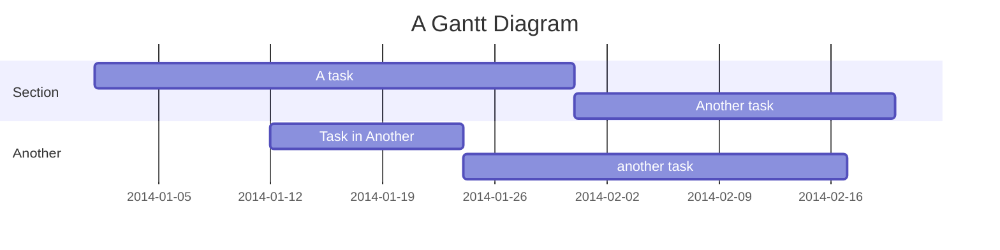
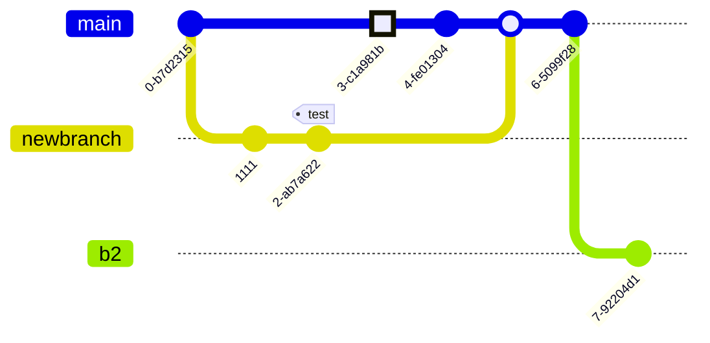
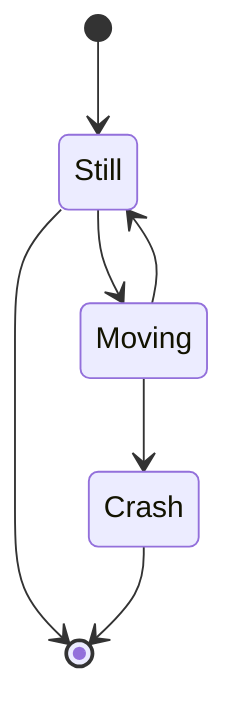
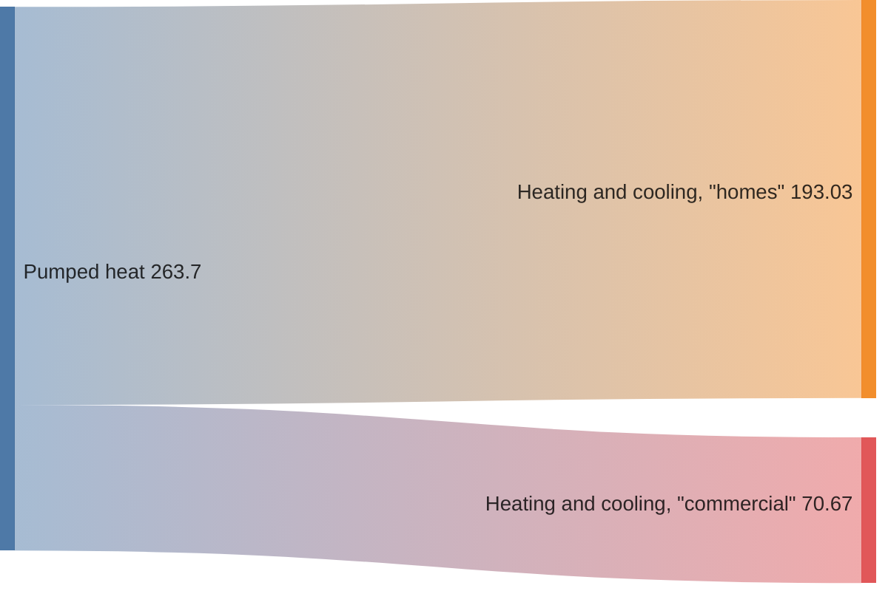
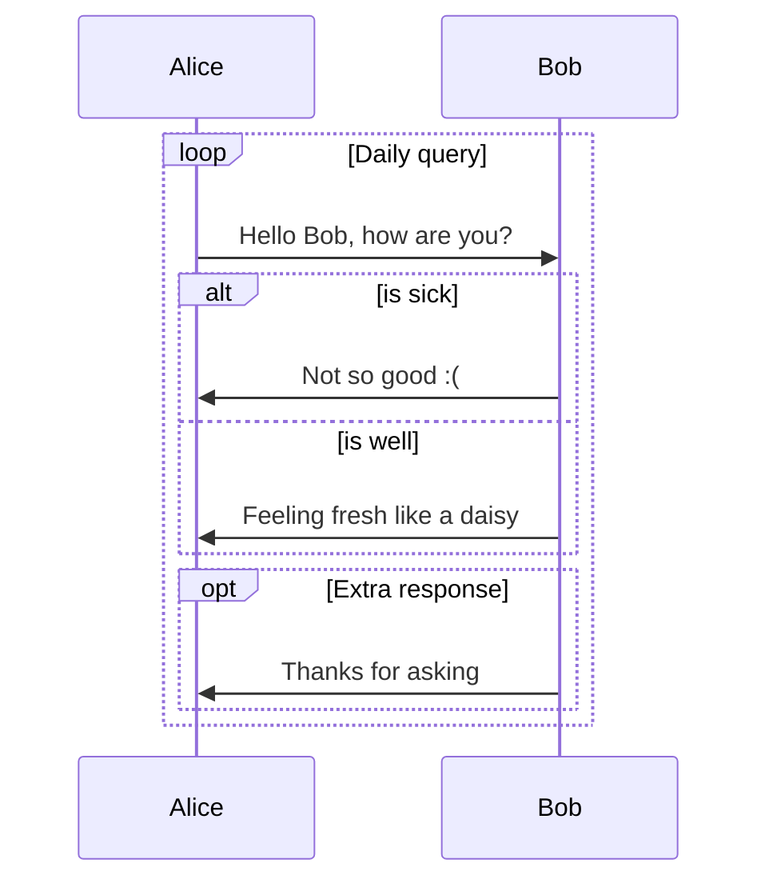
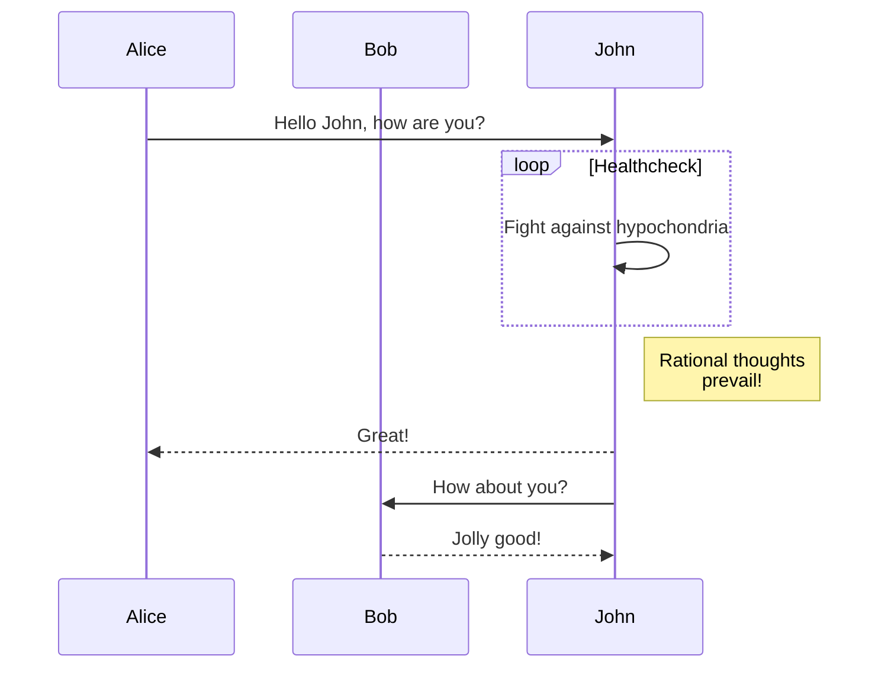

+++
author = "Hugo Authors"
title = "Demo - Support for Diagrams"
date = "2024-05-06"
description = "Guide to advanced usage of Anubis2"
tags = [
    "emoji",
]
+++

Feel free to switch between the light and dark themes to see how the diagram adapts its colors accordingly.

## Mermaid Diagrams



Get more examples at [About Mermaid](https://mermaid.js.org/intro/)

<!--more-->












## GoAT

```goat
      .               .                .               .--- 1          .-- 1     / 1
     / \              |                |           .---+            .-+         +
    /   \         .---+---.         .--+--.        |   '--- 2      |   '-- 2   / \ 2
   +     +        |       |        |       |    ---+            ---+          +
  / \   / \     .-+-.   .-+-.     .+.     .+.      |   .--- 3      |   .-- 3   \ / 3
 /   \ /   \    |   |   |   |    |   |   |   |     '---+            '-+         +
 1   2 3   4    1   2   3   4    1   2   3   4         '--- 4          '-- 4     \ 4
```
